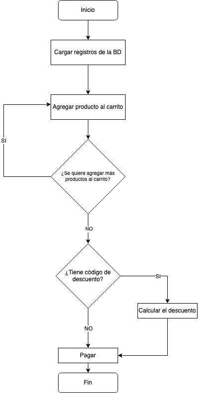

# Generador de facturas

## Problema

- En un supermercado se necesita una aplicación para generar facturas de venta automáticamente.
- Deben haber productos precargados en una base de datos, cada producto tiene un id, nombre y valor.
- Al seleccionar cada producto y su cantidad comprada, se va agregando a una factura que indica: cantidad, nombre del producto, valor por unidad y valor total por producto. Al final, mostrar el valor total a pagar.

## Solución

La solución propuesta a este problema se encuentra desplegada en este [enlace](https://generador-facturas-platzi.netlify.app/)

## Tecnologias usadas

Las tecnologias usadas para desarrollar este proyecto se encuentran:

- Webpack
- Vanilla JavaScript
- Sass
- Firebase

## Instrucciones de uso

Si se quiere usar la aplicación de forma local

```
git clone https://github.com/ZajithCorro/generador-facturas.git
cd generador-facturas
npm install
```

Si se quiere lanzar la aplicación en un entorno de desarrollo

```
npm run dev
```

Si se quiere generar la aplicación para producción

```
npm run build
```

## Diagrama de flujo


